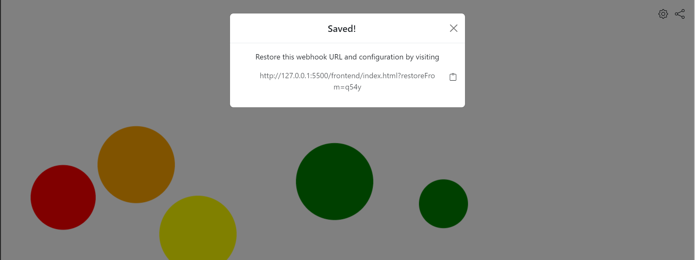

# Bubbles
Bubbles is a simple webhook visualizer. When the application loads, the user is presented with a URL. When data is posted to that URL, a bubble appears and floats across the screen.

The bubbles can be configured to scale their sizes based on the payload sent to the URL. Adding more bubble configuration options would be cool, and I'm hoping I'll get around to it :)





## Overview

### New webhook flow
Bubbles consists of a client application (mostly pure Javascript, the bubble settings modal uses React) and a server (Node.js).

When the client starts, it opens a WebSocket connection to the server. The server generates a random webhook URL, and sends it to the client over the WebSocket.

Whenever a request arrives on the webhook URL, it's proxied to the client application over the Websocket.

### Persisted webhook flow
The user can choose to save a configuration (the webhook URL + bubble config) in order to avoid getting a new webhook URL next time they reload the page.

When the user clicks the "Share" button, the client sends a persistence request to the backend over the WebSocket. The request contains its current bubble configuration.

The server generates a long persistence key and stores it in a database (mapping the persistence key to the webhook URL and the provided config). It then passes
the persistence key back to the client, which creates a restore URL on the form `{current client Url}?restoreFrom={persistence key}`.

When loading, the client checks for a `restoreFrom` query param, and appends it to the WebSocket URL it connects to (e.g. `ws://hook.example.com/mykey123`).

If the server finds a stored webhook URL and bubble configuration for the provided persistence key, it passes the stored URL and config back to the client instead of creating a random webhook URL

## Development
### Running the server
The first time you run the server, you'll need to install the [ws](https://www.npmjs.com/package/ws) package, which is the WebSocket library used by the server:

```
cd backend
npm install
```

In the future, you just need to execute server.js somehow. I recommend using `nodemon` (included as a dev dependency) for automatically reloading it when you make change:

```
npx nodemon server.js
```

### Building the frontend
The frontend uses Webpack to manage the Bootstrap and React dependencies. Webpack, in turn, delegates to Babel in order to preprocess the React JSX. For development, I recommend:

```
cd frontend
npm install # only first time
npx webpack --watch
```

This will compile every necessary file from `frontend/src` into `frontend/out/bundle.js`.

After this, open [index.html](frontend/index.html) in a browser to run the application. I recommend using some sort of auto-reload functionality for index.html as well (for example, [Live Server extension](https://marketplace.visualstudio.com/items?itemName=ritwickdey.LiveServer) for VSCode).
